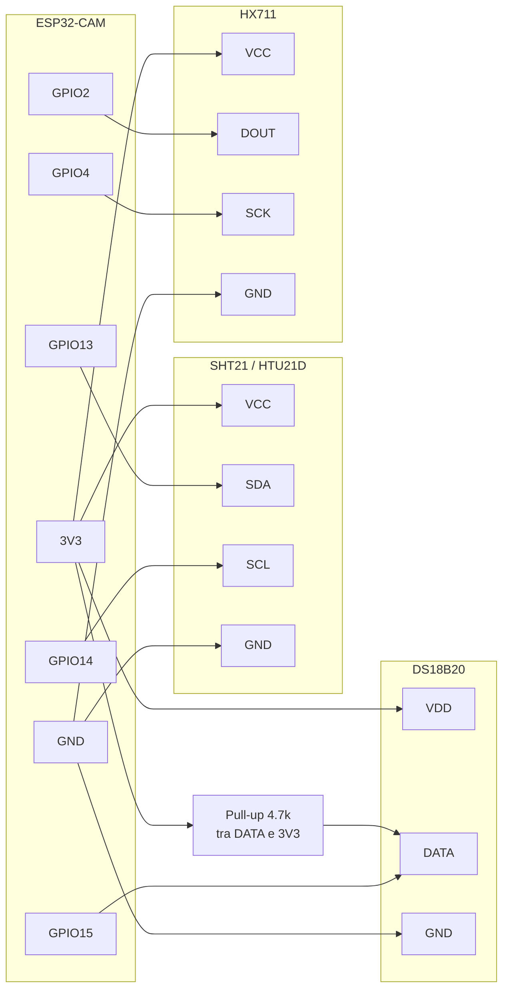

# Schema Pin ESP32-CAM

Questa mappa e' pensata per il firmware corrente in `src/esp` e presuppone:

- niente microSD collegata
- LED flash onboard non usato come uscita applicativa
- camera lasciata montata sulla scheda

## Mermaid

## Lista modifiche cablaggio

- `DS18B20 DATA`: da `GPIO2` a `GPIO15`
- `SHT21 SDA`: da `GPIO12` a `GPIO13`
- `SHT21 SCL`: da `GPIO13` a `GPIO14`
- `HX711 DOUT`: da `GPIO14` a `GPIO2`
- `HX711 SCK`: da `GPIO15` a `GPIO4`
- `LED onboard`: liberato da `GPIO4`, non piu' usato dal firmware

## Alimentazioni

- `DS18B20 VDD -> 3V3`
- `SHT21 VCC -> 3V3`
- `HX711 VCC -> 3V3` consigliato quando il modulo parla direttamente con ESP32-CAM
- `Tutti i GND` in comune

## Note pratiche

- Se il flash via USB fallisce, scollega temporaneamente `HX711 DOUT` da `GPIO2`.
- Se compare `brownout detector was triggered`, il problema e' alimentazione, non pin.
- Sul `DS18B20` mantieni il pull-up da `4.7k` tra `DATA` e `3V3`.
